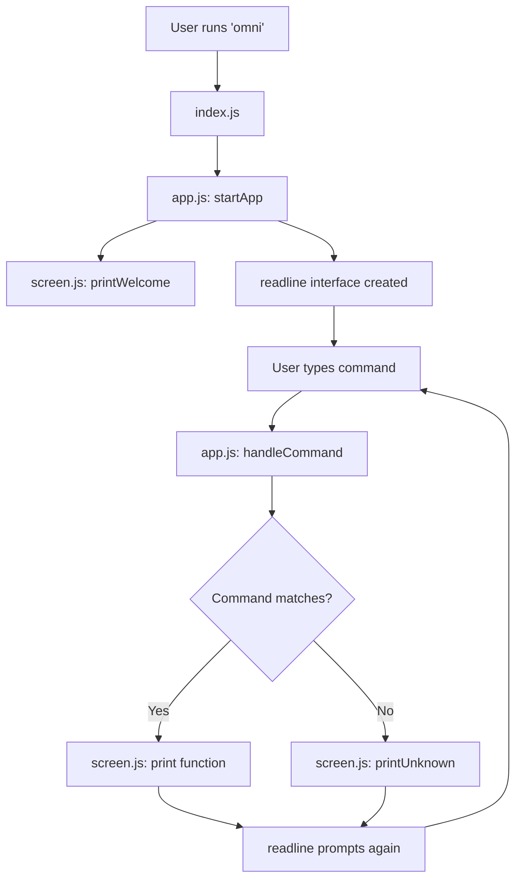

## System overview

OMNI is built on three core modules:

1. **`index.js`**: Entry point that invokes the application
2. **`app.js`**: Command routing and readline interface management
3. **`screen.js`**: Display logic and color system

The architecture is intentionally simple. There's no framework, no abstraction layers, and no magic. Just Node.js, a handful of utilities, and clear separation of concerns.



## Entry point: index.js

The entry point is deliberately minimal:

```javascript
#!/usr/bin/env node

const { startApp } = require('./app');

startApp();
```

The shebang (`#!/usr/bin/env node`) allows the file to be executed directly when linked globally via `npm link`. This is what makes the `omni` command work from anywhere on your system.

<Note>
In `package.json`, the `bin` field maps `omni` to `./src/index.js`. When you run `npm link`, this creates a symlink in your global npm binaries directory, making `omni` available system-wide.
</Note>

## Command routing: app.js

This is where the core logic lives. The file handles three responsibilities:

1. Command registration
2. Command routing
3. Readline interface management

### Command registry

All available commands are defined in a simple array:

```javascript
const COMMANDS = ['/help', '/clear', '/version', '/about', '/exit', '/quit'];
```

This array serves double duty:
- It's used by the autocomplete system
- It's a single source of truth for what commands exist

### Command handler

The `handleCommand` function (line 16) is the router. It takes raw input, normalizes it, and dispatches to the appropriate screen function:

```javascript
function handleCommand(input) {
  const cmd = input.trim().toLowerCase();

  if (!cmd) return true;

  switch (cmd) {
    case '/help':
      printHelp();
      return true;
    case '/clear':
      printWelcome();
      return true;
    case '/version':
      printVersion();
      return true;
    case '/about':
      printAbout();
      return true;
    case '/exit':
    case '/quit':
    case '/q':
      printGoodbye();
      return false;
    default:
      printUnknown(cmd);
      return true;
  }
}
```

The return value is critical. Returning `true` tells the readline loop to continue prompting. Returning `false` terminates the application.

<Tip>
This pattern makes state management trivial. The readline loop only continues if `handleCommand` returns `true`. No need for global flags or complex state machines.
</Tip>

### Readline interface

OMNI uses Node.js's built-in `readline` module to create an interactive prompt. The setup happens in `startApp()` (line 45):

```javascript
const rl = readline.createInterface({
  input: process.stdin,
  output: process.stdout,
  prompt: PROMPT,
  completer: (line) => {
    const hits = COMMANDS.filter((c) => c.startsWith(line));
    return [hits.length ? hits : COMMANDS, line];
  }
});
```

The `completer` function implements autocomplete. When you type `/h`, it returns all commands starting with `/h` (in this case, `/help`). The readline module handles Tab completion automatically.

## Advanced readline customization

OMNI goes beyond basic readline functionality by overriding the internal `_refreshLine` method to implement two features:

1. **Ghost text**: Grayed-out preview of the first matching command
2. **Dropdown**: List of all matching commands

This requires careful manipulation of cursor position and screen output.

### Ghost text implementation

```javascript
const matches = COMMANDS.filter(c => c.startsWith(line));

if (matches.length > 0 && this.cursor === line.length) {
  const firstMatch = matches[0];
  const ghost = firstMatch.slice(line.length);

  // Print ghost text inline
  process.stdout.write(chalk.gray(ghost));
  readline.moveCursor(process.stdout, -ghost.length, 0);
  // ...
}
```

Here's what happens:

1. Filter commands to find matches
2. Extract the untyped portion of the first match
3. Write it to stdout in gray
4. Move the cursor back to where the user is typing

The result is inline autocomplete, similar to what you see in modern shells.

### Dropdown rendering

After the ghost text, OMNI renders a dropdown:

```javascript
const dropdownLines = Math.min(matches.length, 5);
process.stdout.write('\n');

for (let i = 0; i < dropdownLines; i++) {
  process.stdout.write('    ' + chalk.gray(matches[i]) + '\n');
}

lastDropdownLines = dropdownLines;
readline.moveCursor(process.stdout, 0, -(dropdownLines + 1));
```

This:

1. Limits the dropdown to 5 items max
2. Writes each match on a new line with indentation
3. Tracks how many lines were written
4. Moves the cursor back up to the input line

The `lastDropdownLines` variable is crucial—it allows OMNI to clear the dropdown before drawing the next frame.

<Warning>
Directly manipulating `_refreshLine` is non-standard and relies on internal readline APIs. This works but may break in future Node.js versions. Consider this a calculated tradeoff for a polished UX.
</Warning>

### Dropdown cleanup

To prevent visual artifacts, OMNI clears the dropdown before each refresh and on specific keypresses (like Enter):

```javascript
process.stdin.on('keypress', (str, key) => {
  if (key && key.name === 'return' && lastDropdownLines > 0) {
    readline.moveCursor(process.stdout, 0, 1);
    readline.clearScreenDown(process.stdout);
    readline.moveCursor(process.stdout, 0, -1);
    lastDropdownLines = 0;
  }
});
```

This ensures the dropdown disappears the moment you execute a command, keeping the interface clean.

## Display layer: screen.js

All visual output is handled by `screen.js`. This module exports functions that print specific screens:

- `printWelcome()`: Logo and initial instructions
- `printHelp()`: Command list
- `printAbout()`: Description of OMNI
- `printVersion()`: Current version number
- `printUnknown()`: Error message for invalid commands
- `printGoodbye()`: Exit message

Each function uses `chalk` for colors and formatting but never touches readline or state management. This separation makes the code easy to reason about.

### Color system

OMNI uses a custom gradient system for the logo. Instead of hardcoding colors for each line, it interpolates between two RGB values:

```javascript
function interpolateColor(color1, color2, factor) {
  const result = color1.slice();
  for (let i = 0; i < 3; i++) {
    result[i] = Math.round(result[i] + factor * (color2[i] - color1[i]));
  }
  return result;
}

const cosmicPurple = [138, 43, 226];
const cosmicCyan = [0, 255, 255];
```

Then in `printWelcome()` (line 26):

```javascript
LOGO_LINES.forEach((line, index) => {
  const factor = LOGO_LINES.length > 1 ? index / (LOGO_LINES.length - 1) : 0;
  const [r, g, b] = interpolateColor(cosmicPurple, cosmicCyan, factor);
  console.log(chalk.rgb(r, g, b).bold(line));
});
```

This creates a smooth gradient from purple at the top to cyan at the bottom. The `factor` represents how far through the logo we are (0 to 1), and the interpolation calculates the exact RGB values for that position.

<Note>
The gradient is calculated dynamically based on the number of lines in the logo. If you change the logo, the gradient adapts automatically.
</Note>

### Prompt styling

The prompt itself is styled using `chalk.rgb()` with a specific shade of purple:

```javascript
const PROMPT = chalk.rgb(138, 43, 226)('  omni > ');
```

This matches the top of the logo gradient, creating visual consistency throughout the interface.

## Data flow

Here's how a typical interaction flows through the system:

1. User types `/help` and presses Enter
2. Readline emits a `line` event with the input
3. `app.js` event handler calls `handleCommand('/help')`
4. `handleCommand` normalizes input to `/help`
5. Switch statement matches the `/help` case
6. `printHelp()` from `screen.js` is called
7. Help text is written to stdout
8. `handleCommand` returns `true`
9. Readline calls `rl.prompt()` to show the prompt again
10. User can type another command

The flow is linear and predictable. No async complexity, no event bus, no middleware. Just functions calling functions.

## Dependency footprint

OMNI relies on only two external packages:

1. **`chalk@4.1.2`**: Terminal color styling
2. **`prompts@2.4.2`**: Interactive prompts (not currently used, likely for future features)

Everything else is Node.js built-ins:
- `readline`: Interactive input
- `process`: stdout/stdin/exit
- `require()`: Module system

This minimal dependency tree reduces maintenance burden and ensures long-term stability.

## Extensibility points

To add a new command to OMNI:

1. Add the command string to the `COMMANDS` array in `app.js:14`
2. Add a case to the switch statement in `handleCommand()` (around `app.js:21`)
3. Create a corresponding `print*()` function in `screen.js` or call your own logic
4. Export the function if it's in `screen.js`

For more complex features (like task management), you'd likely:

1. Create a new module (e.g., `tasks.js`)
2. Require it in `app.js`
3. Add command cases that call functions from your module
4. Store data in a file or database

The architecture doesn't constrain you. It's just JavaScript.
